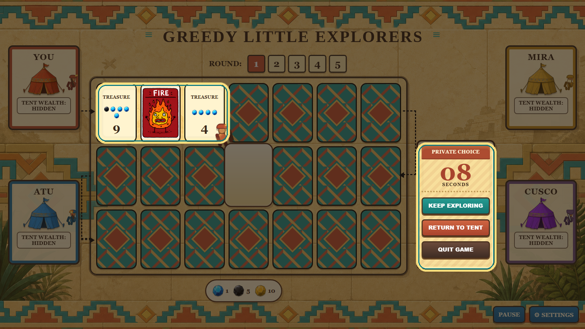

# Greedy Little Explorers

**CID:** 02573495.

Greedy Little Explorers is a browser-based push-your-luck strategy board game about greed, risk and terrible cave decisions. Players enter a cursed temple, reveal treasure, danger and relic cards, then choose whether to escape safely or gamble on one more step.

Each round becomes a small psychological battle: return too early and you may miss the best treasure; stay too long and one repeated danger can wipe out everything you carried.

**Go deeper. Get greedy. Try not to die.**



## Game reference

The main design is inspired by the tabletop game **Incan Gold / Diamant**. I
used its central push-your-luck idea: players can continue deeper into the cave
for more treasure, but a repeated danger can wipe out the loot carried by anyone
still inside.

This version adapts that reference into a browser game with:

- a five-round match structure;
- a visible 20-card route each round;
- entry deposits paid with blue gems;
- solo-return relic rewards;
- local multiplayer or bot opponents;
- a guided How To Play carousel with spotlight screenshots.

## How to play

Each explorer starts with four blue gems. At the start of a round, active
explorers pay one gem as a deposit to enter the cave. On each turn, the active
explorer rolls the dice, moves along the route and reveals or revisits a card.

Card effects:

- **Treasure:** treasure is left on the route until explorers return to camp.
- **Danger:** the first copy is a warning; a second matching danger ends the
  round for explorers still inside.
- **Relic:** a relic is scored only when exactly one explorer returns to camp.

After each reveal, explorers choose to keep exploring or return to camp. Safe
returners secure carried loot, shared route treasure and their refunded deposit.
After five rounds, the highest secured score wins. Relic count breaks score ties.

## Code structure

- `web-app/GreedyLittleExplorers.js` - the DOM-free rules module and public API.
- `web-app/main.js` - browser UI state, input handling, timers, animation and
  audio.
- `web-app/index.html` - menu, rules carousel, game screen, settings and final
  ranking markup.
- `web-app/default.css` - board layout, cards, characters, popups and responsive
  visual styling.
- `web-app/tests/GreedyLittleExplorers.test.js` - Mocha unit tests for the rules module.
- `web-app/tests/TEST-SPECIFICATION.md` - written test plan with inputs and
  expected results.
- `docs/` - generated JSDoc API documentation.

The artwork, audio and tutorial images are stored in `web-app/assets/`.

## Rules module and API

The core game logic is separated from the browser. `GreedyLittleExplorers.js` uses plain
JavaScript data and pure-style functions so the rules can be tested without
opening the page. The UI calls this module instead of duplicating score, deck or
danger logic in the DOM layer.

Public functions intended for review:

- `createPlayers(options)`
- `createRoundDeck(options)`
- `preparePlayersForRound(players, options)`
- `distributeTreasure(players, card)`
- `settleReturningPlayers(players, revealed, leavingIds)`
- `failRound(players, dangerPool, dangerName, options)`
- `chooseBotAction(player, context)`
- `scorePlayer(player)`
- `rankPlayers(players)`

Important implemented rules:

- treasure values stay on the route until players return;
- shared returns split all visible route treasure and leave remainders behind;
- solo returns claim visible relics, with relic number multiplied by 10;
- duplicate dangers fail the round for active explorers;
- only the first two duplicated danger types are removed from later decks;
- final scoring counts secured tent points, not unspent wallet gems.

## Testing and documentation

The project includes both a written test specification and executable unit tests.
The tests focus on the reusable rules module rather than the browser animation
layer.

Current covered behaviours include:

- deterministic shuffle behaviour;
- round setup, deposits and final-round drop rules;
- deck composition;
- route treasure accumulation;
- safe returns, shared treasure and relic claims;
- duplicate danger failure and danger removal limits;
- final ranking and tie-breaking.

JSDoc comments in `GreedyLittleExplorers.js` generate the API pages in `docs/`.

## How to run

Install dependencies once:

```bash
npm install
```

Run the checks:

```bash
npm test
npm run docs
npm run lint
```

To play, serve the project with a local web server and open:

```text
http://127.0.0.1:5500/web-app/index.html
```

For example, this can be done with the Live Server extension in VS Code.
Double-clicking the HTML file may block module imports or audio in some
browsers, so a local server is recommended.

